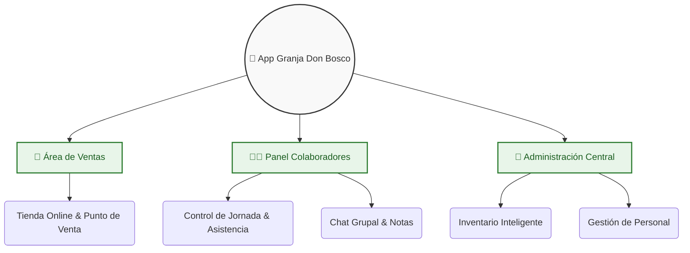

# 🚜 SISTEMA DE GESTIÓN Y VENTAS - GRANJA DON BOSCO

---¡Bienvenidos al repositorio oficial de nuestro proyecto! 🌾✨ Este sistema nace de la necesidad de modernizar las operaciones diarias de **Granja Don Bosco**, llevando el control de inventario, ventas y equipo humano de las libretas de papel a la palma de la mano.

---

## 🌐 FILOSOFÍA Y REFERENCIA TÉCNICA
Este sistema fue diseñado y desarrollado originalmente para la modernización operativa de la **Granja Don Bosco**. Como autores, **Rodrigo Ariel y Melvin Omar** hemos decidido mantener el código con una visión de transparencia, sirviendo como una **referencia técnica** para el sector agropecuario. 

Aunque el proyecto nace para una entidad privada, creemos que puede servir como base o inspiración para la digitalización de otros entornos similares, fomentando la colaboración técnica y el intercambio de buenas prácticas en la comunidad.

---

### 👨‍💻 Equipo de Desarrollo
Este proyecto ha sido diseñado y desarrollado con mucho entusiasmo por:
*   **Melvin Omar Lopez Callejas**
*   **Rodrigo Ariel Lopez Callejas**

---

## 🌟 ¿POR QUÉ CREAMOS ESTE SISTEMA?
En una organización como una granja, el orden es vital. Queríamos una herramienta que no solo vendiera productos, sino que ayudara a los que trabajan allí todos los días.

### 🔑 Con esta app logramos tres cosas principales:

*   **🛒 Ventas sin enredos:** El cliente elige fácil (libras, botellas, unidades) y el equipo registra el cobro al instante.
*   **👷 Un equipo conectado:** Los colaboradores tienen su propio panel para marcar su jornada (entrada, almuerzo, salida) y un chat interno para no perder la comunicación en el campo.
*   **📊 Control absoluto:** El administrador puede ajustar precios en un segundo y recibir alertas automáticas si el stock de algún producto está por terminarse.

---

## 🚀 TECNOLOGÍAS UTILIZADAS

### 🗺️ ¿Cómo funciona? (Estructura del Proyecto)

---

### 🛠️ Tecnología Detrás del Proyecto
Para que la app sea rápida y confiable, elegimos herramientas modernas:
*   **Frontend:** Construido con `React` y `Vite`, diseñado para ser responsivo (se ve genial tanto en PC como en el celular).
*   **Base de Datos:** Potenciado por `Supabase`, lo que nos da seguridad y sincronización de datos en tiempo real.